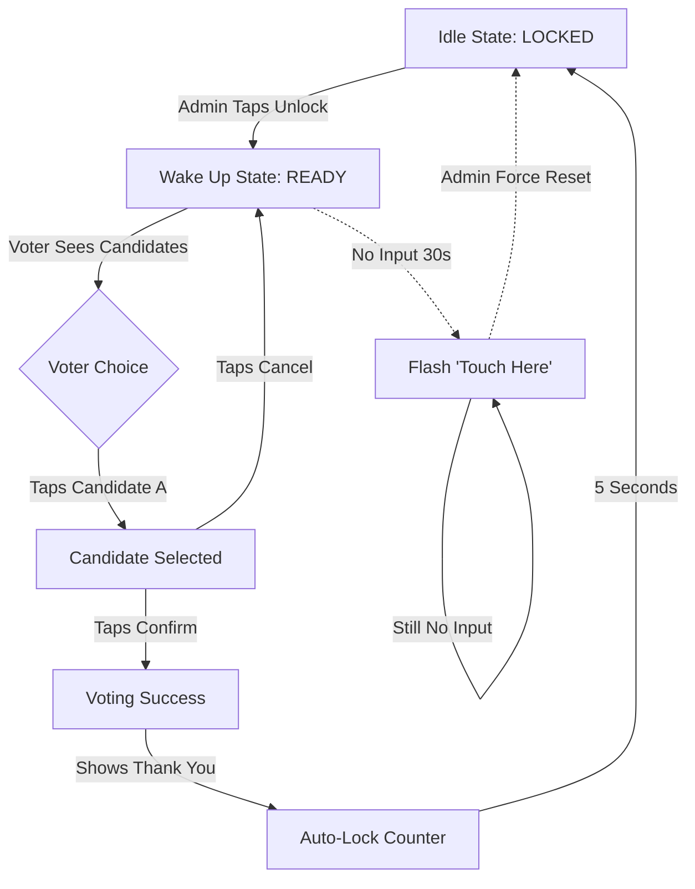

# UX Design Specification e-voting-system

**Author:** Daffaalfandy
**Date:** 2026-01-11

---

<!-- UX design content will be appended sequentially through collaborative workflow steps -->

## Executive Summary

### Project Vision
A "Digital Polling Booth" that feels as simple and trusted as a paper ballot. The core experience relies on the **"Committee Remote Control"** pattern, where the complexity of authentication is handled physically by humans (the committee), allowing the digital voter interface to remain radically simple for elderly users.

### Target Users
1.  **Pak Budi (The Voter):** Elderly (60+), eyesight issues, unfamiliar with apps. Needs **Current-Action Focus** (one thing at a time), giant buttons, and clear "Success" confirmation to feel their duty is done.
2.  **Bu Sari (The Admin):** Busy, managing a queue. Needs **Glanceable Status** (Is the booth free?) and **One-Tap Control** (Unlock).

### Key Design Challenges
*   **The "Invisible" Unlock:** The Admin triggers an action on *their* phone that affects *another* device (Laptop). The UX must bridge this gap with sub-second feedback so Bu Sari knows "It worked" without walking over to check.
*   **Trust in Secrecy:** The UI must clearly demonstrate that the vote is anonymous. The transition from "Voting" to "Thank You" must feel final and disconnected from the voter's identity.

### Design Opportunities
*   **"The Magic Reveal":** The transition from "Voting Booth" to "Results Dashboard" at the end of the event can be a celebrated moment of transparency—a high-impact visual animation.

## Core User Experience

### Defining Experience
The product is not a "website" but a **"Digital Appliance"**. For the voter, it behaves like an ATM: You walk up, do one specific transaction, and leave. For the admin, it behaves like a TV Remote: Point (virtually) and click to change the channel (unlock).

### Platform Strategy
*   **Kiosk (Voter):** Zero-scrolling, fixed viewport. No "Back" buttons. No menus. Just the grid.
*   **Mobile (Admin):** One-thumb interaction zone. High-contrast status indicators (Green/Yellow/Red) for outdoor visibility.

### Effortless Interactions
*   **"No Login" Voting:** The voter never sees a login screen. Identification is human-to-human.
*   **"Auto-Reset":** The kiosk cleans itself up. Voter leaves? It locks. Vote done? It locks.

### Critical Success Moments
*   **The "Unlock" Sync:** When Bu Sari taps "Unlock", the Kiosk must wake up *instantly*. If there's a 5-second lag, she will doubt the system and click again.

### Experience Principles
*   **Principle 1 (Focus):** One screen, one action. Never overwhelm Pak Budi.
*   **Principle 2 (Feedback):** Instant visual confirmation for every interaction (Unlock, Tap, Vote).
*   **Principle 3 (Trust):** Privacy by design—interfaces clearly show what is being recorded (the vote) and what isn't (the voter's ID).

## Desired Emotional Response

### Primary Emotional Goals
*   **Voter (Pak Budi): Dignified Competence.** He should feel "Modern" and "Capable." The system should make him feel like he is participating in a high-tech, trustworthy democratic process, not just "pressing buttons."
*   **Admin (Bu Sari): Absolute Command.** She must feel a direct, mechanical connection to the booth. If she presses "Unlock," it unlocks. No spinning wheels. No ambiguity.

### Emotional Journey (The "Vote" Loop)
1.  **Approach (Voter):** *Respectful Anticipation.* The screen is waiting for *him*. It looks official.
2.  **Interaction (Voter):** *Clarity.* "I see exactly who to choose."
3.  **Completion (Voter):** *Finality.* The "Thank You" screen operates like a digital receipt. It feels permanent and recorded.
4.  **Monitoring (Admin):** *Vigilance.* She sees the status change instantly, confirming the system works.

### Micro-Emotions
*   **Avoid "Powerless":** For the Admin, we will add a "Heartbeat" indicator so she always knows the system is online, preventing the fear of being "blind" to the kiosk's state.
*   **"Official" vs "Fun":** We will use a formal color palette (e.g., Flag Red/White, Deep Slate) and formal Indonesian phrasing ("Suara Anda Telah Direkam" vs "Terima Kasih!").

### Design Implications
*   **Typography:** Large, sans-serif, but authoritative (e.g., similar to government signage).
*   **Visuals:** No cartoons. Use high-fidelity photos for candidates. Use a "Seal" or "Checkmark" emblem for success.
*   **Motion:** Snap interactions. Fast transitions. No bouncy springs.

## UX Pattern Analysis & Inspiration

### Inspiring Products Analysis
*   **ATM (Bank Mandiri/BCA) -> For The Voter:** 
    *   **Why it works:** It is rigid, linear, and impossible to "break." It asks one question at a time ("Language?" -> "Pin?" -> "Amount?"). 
    *   **Key Insight:** Users don't "browse" an ATM; they "obey" it. This matches the solemnity of voting.
*   **WhatsApp Status -> For The Admin:**
    *   **Why it works:** It provides high-density information (who saw my status) in a simple, glanceable list.
    *   **Key Insight:** Bu Sari needs to see the "Status" of the voting booth (Occupied/Free) just as easily as checking a WhatsApp story.

### Transferable UX Patterns
*   **The "Giant Touch Zone" (ATM):** Buttons should be massive (e.g., 20% of viewport height). Interaction areas should be distinctly separated.
*   **Linear Flow (ATM):** No "Back" buttons unless critical. Forward-only progression.
*   **Status Rings (WhatsApp):** Use color-coded rings or borders to indicate state (Green = Ready, Red = Occupied) that can be understood from 2 meters away.

### Anti-Patterns to Avoid
*   **The "Scroll of Doom":** Any interface requiring scrolling is a failure. All candidates must fit on one screen, or use strict pagination.
*   **"Form Filling":** No text inputs. No dropdowns. Only tapping.
*   **Small Text:** Anything smaller than 16px (or equivalent relative unit) is forbidden.

### Design Inspiration Strategy
*   **Adopt:** The "Kiosk" layout from ATMs. Fixed viewport, zero scroll, high contrast.
*   **Adapt:** The "Chat List" density from WhatsApp for the Admin view, turning "Chats" into "Log Entries" or "Status Indicators."
*   **Avoid:** Any web-native patterns like "blue links," "hamburger menus," or "footers."

## Design System Foundation

### Design System Choice
**TailwindCSS + Headless Components (Radix UI)**

### Rationale for Selection
*   **Total Layout Control:** To achieve the "ATM Kiosk" feel, we need rigid, pixel-perfect control over touch targets and spacing, which Tailwind provides better than pre-styled component libraries like MUI.
*   **Performance:** Tailwind's atomic CSS approach ensures the bundle remains small, critical for loading on potentially slow mobile connections for the Admin.
*   **"Un-Web" Aesthetic:** We want to avoid the generic "Bootstrap/Material" look. By building from scratch with Tailwind, we can create a bespoke "Digital Appliance" aesthetic that feels distinct from a standard website.

### Implementation Approach
*   **Strict Config:** We will configure `tailwind.config.js` to restrict colors and spacing to our specific design tokens, ensuring consistency.
*   **Custom "Touch" Scale:** We will define custom spacing utilities (e.g., `h-touch-target`) to guarantee all interactive elements meet accessibility standards for elderly users.
*   **Component Strategy:** We will build a small set of highly reusable, coarse-grained components (e.g., `BigButton`, `CandidateCard`, `StatusBanner`) rather than a comprehensive general-purpose library.

### Customization Strategy
*   **Theme:** "State Ceremony". Colors will be authoritative (Flag Red, White, Slate) rather than playful.
*   **Typography:** System fonts (San Francisco/Segoe UI) to feel "native" to the device, or a robust open-source sans-serif like **Inter** for better readability on all screens.

## 2. Core User Experience

### 2.1 Defining Experience: "The Committee Unlock"
The most critical interaction is the **handoff** between the Committee (Admin) and the Voter. It effectively "digitizes" the act of handing over a paper ballot.
*   **Trigger:** Bu Sari taps "Buka Bilik Suara" (Unlock Booth) on her phone.
*   **Action:** The Kiosk instantly wakes up from a "Locked" state.
*   **Result:** Pak Budi sees that the booth is now ready for *him* specifically.

### 2.2 User Mental Model
*   **Voter:** "I am waiting for permission. Once given permission, I must do my duty quickly." (Similar to waiting for a bank teller to wave you forward).
*   **Admin:** "I am the gatekeeper. I open the door, they vote, I close the door." (Similar to a traffic cop).

### 2.3 Success Criteria
*   **Zero Latency:** The Kiosk must unlock within <1000ms of the Admin tapping the button.
*   **Obvious Handoff:** The Kiosk must explicitly acknowledge *who* unlocked it (e.g., "Unlocked by Committee").
*   **Error Recovery:** If the internet fails, the specific state (Loading vs Failed) must be clear on the Admin's phone so she doesn't spam the button.

### 2.4 Novel UX Patterns
*   **"Remote Control" Pattern:** We are using a mobile device to control a separate stationary device. This is rare in web apps but common in smart home tech (e.g., Casting to TV). We will borrow the "Cast" metaphor—clear feedback on the *controller* that the *receiver* has accepted the command.

### 2.5 Experience Mechanics
1.  **Initiation (Admin):**
    *   Bu Sari taps "Unlock".
    *   **UI Response:** The button turns into a **"Sending Signal..." spinner** immediately (local state) to prevent double-taps.
2.  **Wake Up (Kiosk/Voter):**
    *   Screen transitions from "LOCKED" to "READY".
    *   **Visual:** A large banner appears: **"Bilik Dibuka oleh Panitia"** (Booth Unlocked by Committee) for 2 seconds. This confirms transparency.
3.  **Interaction (Voter):**
    *   Voter selects candidate.
    *   **Idle State:** If no interaction for 30s, the screen flashes **"Sentuh Di Sini"** (Touch Here) in high contrast contrast to guide focus.
4.  **Completion:**
    *   Vote Confirmed.
    *   Kiosk Auto-locks.
    *   Admin's phone vibrates (Haptic Success) and button resets to "Unlock".

## Visual Design Foundation

### Color System: "State Ceremony"
We prioritize authority and high contrast over "friendliness."

*   **Primary (Safe Action):** `Deep Slate Blue` (#0F172A)
    *   *Usage:* "Confirm Vote", "Unlock Booth", Key Headers.
*   **Destructive/Admin:** `Indonesian Red` (#D00C0C)
    *   *Usage:* "Reset Booth", "Lock Emergency", Critical Errors.
*   **Success:** `Coblos Green` (#16A34A)
    *   *Usage:* "Vote Recorded", "Booth Ready" indicator.
*   **Background:** `Paper White` (#F8FAFC)
    *   *Usage:* Main background to mimic a clean paper ballot.
*   **Text:** `Slate-900` (#020617)
    *   *Usage:* All primary text for maximum readability.

### Typography System: "The Digital Ballot"
*   **Typeface:** **Inter** (Google Fonts).
*   **Rationale:** Neutral, highly legible, excellent numeral support.
*   **Scale:**
    *   **Candidate Name:** 32px (Bold) - *Massive visibility.*
    *   **Instructions:** 24px (Medium) - *Elderly friendly.*
    *   **Status/Metadata:** 16px (Regular) - *Admin details.*

### Spacing & Layout Foundation
*   **Base Unit:** 4px (Tailwind standard).
*   **Touch Targets:** Minimum **60px height** (h-14/h-16 equivalent) for all interactive elements.
*   **Grid:** Single-column, centered max-width (max-w-md) for mobile (Admin) and Kiosk (Voter) to focus attention.
*   **Gap:** Loose spacing (gap-6 / 24px) between candidates to prevent accidental distinct taps.

### Accessibility Considerations
*   **Contrast:** All text combinations must meet **WCAG AAA** (7:1 ratio) due to the elderly user base.
*   **Touch Areas:** No buttons closer than 12px to each other.
*   **No Reliance on Color:** Statuses (Ready/Occupied) must use **Text Labels + Icons + Color**, not just color.

## Design Direction Decision

### Design Directions Explored
*   **Option A ("The Ballot Box"):** A high-contrast, brutalist direction mimicking physical paper ballots. Features thick borders, flat colors, and sharp corners.
*   **Option B ("The Modern ID"):** A soft, app-like direction with gradients, rounded corners, and drop shadows, familiar to users of modern super-apps.
*   **Option C ("Hybrid"):** A combination of strict, authoritative layout/typography with modern visual cues (shadows/elevation) to signal "High Tech" without losing "Gravitas."

### Chosen Direction
**Option C: Hybrid (Official High-Tech)**

### Design Rationale
*   **Balancing Trust & Modernity:** "The Ballot Box" (Option A) risks feeling outdated or "broken" to younger users, while "The Modern ID" (Option B) feels too casual/commercial for a state election.
*   **The "Hybrid" Sweet Spot:** We will use the **Rigid Typography & Layout** of Option A (to convey authority) but apply **Subtle Elevation & Polish** from Option B (to convey that the system is modern, fast, and expensive/secure).

### Implementation Approach
*   **Container Style:** Cards will have distinct borders (1px Slate-200) *plus* a subtle shadow (`shadow-lg`), blending physical edges with digital depth.
*   **Typography:** Uppercase, tracked-out headers (from Option A).
*   **Interaction:** "Press" states will flatten the shadow (tactile feedback) rather than just changing color.
*   **Corners:** Slightly rounded (`rounded-lg` / 8px) – friendly but not "bubbly".

## User Journey Flows

### 1. The Voter Loop (Happy Path & Handling)

### Flow Optimization Principles
*   **Intentionality over Speed:** We chose to require a "Cancel" tap before switching candidates. This reduces accidental swipes/taps that might confuse an elderly voter.
*   **Human Safety Net:** The Kiosk will *never* auto-lock on timeout while a voter is present. Instead, it flashes guidance ("Sentuh Di Sini"). Only the Admin can force a reset if the voter walks away.
*   **Success Confirmation:** The "Thank You" screen persists for 5 seconds to give Pak Budi closure ("I am done") before the screen goes dark/locked for the next person.

## Component Strategy

### Design System Components
We will leverage **Radix UI Primitives** (Headless) for complex interactive logic to ensure accessibility without fighting pre-made styles.
*   **Dialog/Modal:** For the "Confirm Vote" overlay.
*   **Toast:** For "System Online" or error messages.
*   **Portal:** To ensure modals break out of the z-index stack.
*   **Rationale:** We need the *behavior* of a robust library but the *look* of our custom "Hybrid" design.

### Custom Components
These components will be built from scratch using TailwindCSS to match the specific "Kiosk" requirements.

#### 1. `CandidateCard`
*   **Purpose:** The primary interaction unit.
*   **Anatomy:**
    *   Left: Giant Photo (Aspect Ratio 1:1, Rounded-md).
    *   Center: Giant Candidate Number (e.g., "01") in Slate-200 circle.
    *   Right: Name & Number Text.
*   **Interaction:** Entire card is a touch target. Active state applies a `border-4 border-blue-600` and flattens shadow.
*   **States:** Idle, Selected, Disabled (Opacity 50%).

#### 2. `BigButton`
*   **Purpose:** The primary action trigger ("CONFIRM").
*   **Usage:** Fixed to the bottom of the viewport (`fixed bottom-0`).
*   **Anatomy:** Full width, **80px height**, Uppercase Bold Text (24px).
*   **Visuals:** `bg-slate-900` (Default) -> `bg-green-600` (Confirm State).

#### 3. `StatusBanner`
*   **Purpose:** Communicate system state to Admin and Voter.
*   **Usage:** Fixed to top of viewport.
*   **States:**
    *   **Green:** "SILAKAN MASUK" (Blinking) - Ready to vote.
    *   **Red:** "DIBLOKIR" (Locked) - Waiting for admin.
    *   **Blue:** "MENGHUBUNGKAN..." (Connecting) - Network status.

### Component Implementation Strategy
1.  **Strict Tokens:** All custom components must use the defined Visual Foundation tokens (e.g., `h-touch-target`, `text-slate-900`).
2.  **No Arbitrary Values:** Avoid magic numbers. Use the Design System variables.
3.  **Composition:** Wrap Radix primitives in our custom styles (e.g., `export const Dialog = styled(RadixDialog)...`).

### Implementation Roadmap
*   **Phase 1 (Core Voting):** Build `CandidateCard`, `BigButton`, and `StatusBanner`. (Required for MVP).
*   **Phase 2 (Admin Controls):** Build `AdminToggle` and `VoterLogList`.
*   **Phase 3 (Polish):** Add `Toast` notifications and animations.

## UX Consistency Patterns

### Strict Layout Patterns (The "No Scroll" Rule)
*   **Constraint:** The Voting Kiosk must **NEVER SCROLL**.
*   **Capacity:** The layout is hard-coded for **exactly 4 candidates** (2x2 Grid).
*   **Overflow:** If candidates > 4 (unlikely for RT), we would require a "Next Page" button, but for now, we assume a single static view.
*   **Why:** Scrolling on large vertical touchscreens requires momentum and dexterity that is difficult for elderly users. A static "Dashboard" view is safer.

### System Feedback Patterns
*   **Active Wait:** "Recording Vote..." uses a **Deterministic Progress Bar** (1s to 3s), not an indeterminate spinner. This gives the user correct expectations of wait time.
*   **Double-Tap Safety:** Primary actions (Vote/Unlock) carry a **500ms Debounce** (Disabled State) immediately after touch to prevent accidental double-submission or skipping success screens.

### Audio & Sensory Patterns
*   **Silent Mode:** The kiosk relies 100% on Visual Cues (Colors, Size, Animation). No audio feedback (beeps/voice).
*   **Silent Mode:** The kiosk relies 100% on Visual Cues (Colors, Size, Animation). No audio feedback (beeps/voice).
*   **Haptics:** Admin App (Mobile) *will* use haptics (Vibrate on Unlock), but the Kiosk (Tablet/Screen) will not.

## Responsive Design & Accessibility

### Responsive Strategy: "Two Faces"
The system has two distinct interfaces with different responsive behaviors:

*   **The Kiosk (Kios):**
    *   **Target Device:** iPad / Android Tablet (Landscape Mode).
    *   **Behavior:** Fixed Layout. Shows "Device Too Small" warning on phones.
    *   **Rationale:** Voting requires a large surface area for elderly users. 

*   **The Admin Remote (Panitia):**
    *   **Target Device:** Android Phone (Portrait Mode).
    *   **Behavior:** Responsive Mobile-First Layout.
    *   **Rationale:** Admins need to be mobile and walk around the polling station.

### Accessibility Strategy (Lansia-First)
Our primary demographic includes elderly users (50-80yo) with potential vision or motor impairments.

*   **Text Size:**
    *   Body: **24px** minimum.
    *   Headings: **48px** minimum.
*   **Contrast:** High Contrast (WCAG AAA) is mandatory. No subtle grays for essential text.
*   **Touch Targets:** **60px minimum**.
*   **Timeouts:** Extended idle timeouts (30s) to accommodate slower reading/reaction times.

### Testing Strategy
*   **Device Lab:** Chrome DevTools simulating iPad Air (Kiosk) and Pixel 7 (Admin).
*   **"The Squint Test":** All distinct actions must be identifiable even when blurred (simulating poor vision).
